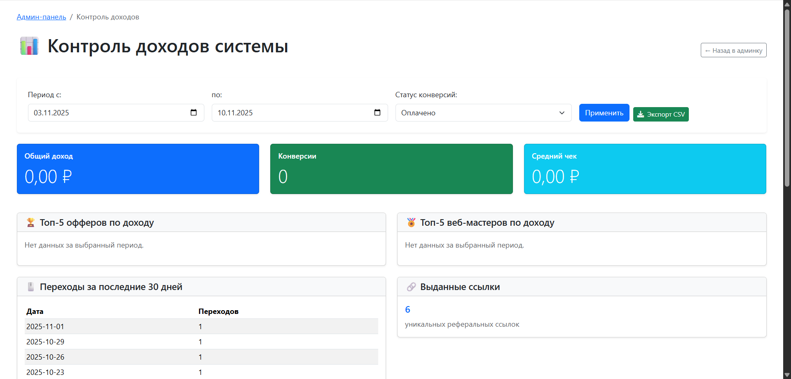
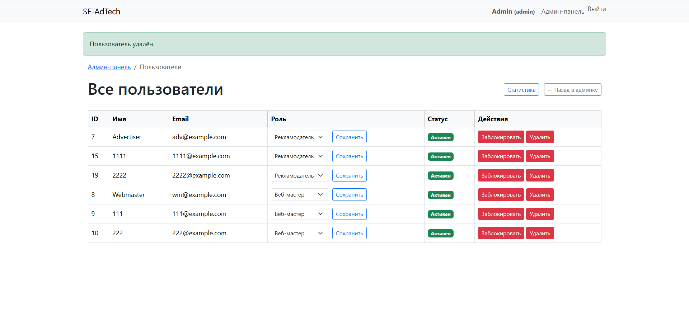
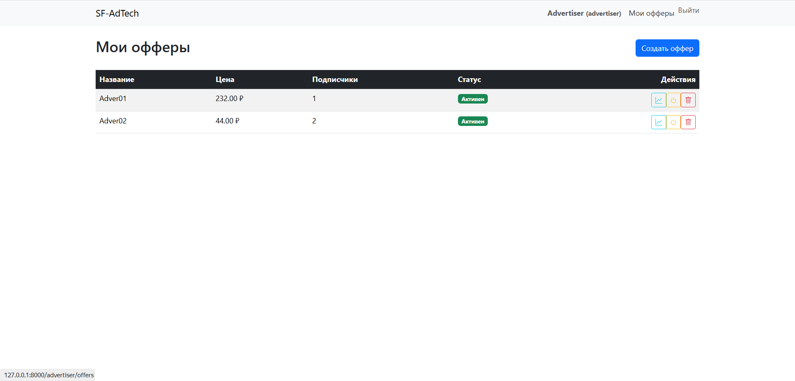
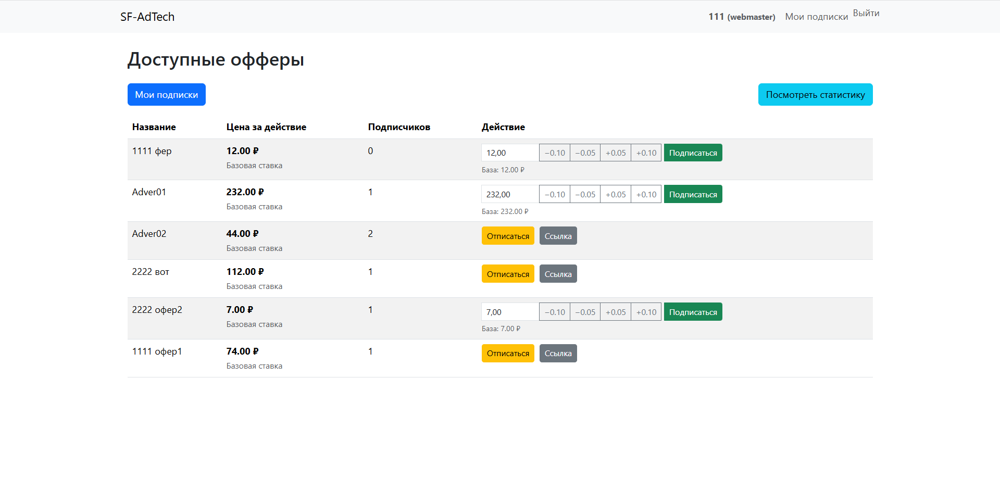

# SF-AdTech 🚀  
**CPA-платформа для рекламодателей и веб-мастеров**


SF-AdTech — это **гибкая рекламная платформа**, которая связывает рекламодателей и веб-мастеров.  
Платформа позволяет запускать офферы, отслеживать переходы, управлять доходами и автоматически перенаправлять трафик.

---

## 🎯 Основные возможности

### 📢 Рекламодатель
- Создание и управление офферами
- Просмотр статистики: клики, расходы (день/месяц/год)
- Контроль подписок веб-мастеров

### 💼 Веб-мастер
- Подписка на офферы
- Получение уникальной ссылки для продвижения
- Просмотр доходов и статистики по переходам

### 🔧 Администратор
- Управление пользователями (вкл/выкл)
- Контроль системы: доходы, ошибки, активность
- Просмотр статистики по всем офферам и кликам

### ⚡ Система редиректа
- Обработка переходов по ссылкам `/r/{token}`
- Проверка подписки веб-мастера
- Логирование кликов и ошибок
- Перенаправление на целевой URL

---

## 🖼 Интерфейс платформы

### Админ-панель
| Статистика | Пользователи |
|-----------|-------------|
|  |  |

### Рекламодатель
| Управление офферами |
|---------------------|
|  |

### Веб-мастер
| Подписка на офферы |
|--------------------|
|  |

---

## 🛠 Технологический стек

- **Backend**: Laravel 10, PHP 8.1+
- **Frontend**: Blade, Bootstrap 5, Alpine.js
- **База данных**: MySQL 5.7+
- **Аутентификация**: Laravel Breeze
- **Отслеживание**: Кастомный редирект с логированием в БД
- **Дополнительно**: Middleware, Jobs, Artisan-команды

---

## 🚀 Быстрый старт

```bash
# 1. Клонировать репозиторий
git clone https://github.com/yourname/sf-adtech.git
cd sf-adtech

# 2. Установить зависимости
composer install
npm install && npm run build  # если используешь Laravel Mix/Vite

# 3. Настроить окружение
cp .env.example .env
php artisan key:generate

# 4. Настроить .env (пример)
DB_DATABASE=sf_adtech
DB_USERNAME=root
DB_PASSWORD=

# 5. Выполнить миграции и seed
php artisan migrate:fresh --seed

# 6. Запустить сервер
php artisan serve

Учётные записи для теста:
------------------------
- Admin: admin@example.com / password
- Advertiser: adv@example.com / password
- Webmaster: wm@example.com / password

Структура проекта:
-----------------
- app/Models/ -> модели данных (User, Offer, Click)
- app/Http/Controllers/ -> контроллеры (AuthController, AdvertiserController, WebmasterController, AdminController, RedirectController)
- app/Http/Middleware/ -> middleware EnsureRole
- resources/views/ -> Blade-шаблоны для интерфейсов
- routes/web.php -> маршруты приложения
- routes/auth.php -> маршруты авторизации
- database/migrations/ -> миграции БД
- database/seeders/ -> генерация начальных данных

Требования:
------------
- Laravel 10.x
- PHP >= 8.1
- MySQL 5.7+ или MariaDB
- Composer
